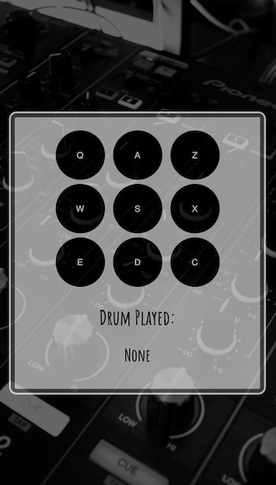

# Drum Set

## Overview

A drum set powered by jQuery, keyboard events, and click events.

## Description

With this project, I took the opportunity to improve my skills in jQuery. I typically code in vanilla JavaScript or in JSX (with React), so this was a nice challenge to see how jQuery syntax slightly differs. It was a great refresher.

This project also differs from other projects I have previously built in that it includes audio clips as a main feature. It was a fun challenge learning how to connect audio play to a keyboard or click event, and I can see how that would be useful in future projects.

This webpage is for entertainment purposes only. Users can either click each drum option on the page to hear the audio play, or they can type a letter on their keyboards that matches one of the drum options.

Please find the deployed page here: https://vruss14.github.io/drum-set

## Technologies Used

- HTML
- CSS
- Google Fonts
- jQuery

## Installation

No installation steps are required to view this project. To view the page, visit the URL above. The application's source code can be found on GitHub here: https://github.com/vruss14/drum-set.

## Usage

This web application includes responsive design and can be viewed on all devices.

Below is a screenshot of the desktop version of the deployed page:

Below is a screenshot of the mobile version of the deployed page:

## Credits

Valerie Russell was the sole contributor to this project. Contact her at vruss14@gmail.com.

### References

* Background image from pexels.com is by Stephen Niemeier
